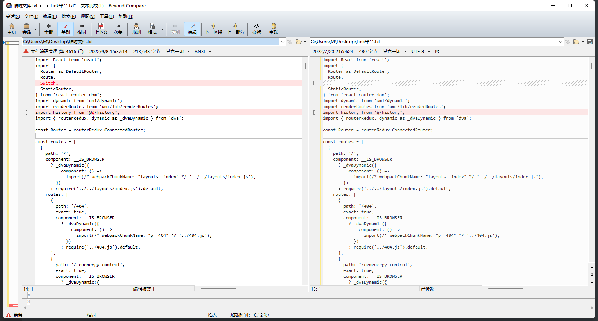

# SourceTree

初学者适合用一些Git工具，这样就不用记那些很长的命令了。我是学了git以后再用工具的，当然会用工具也能节约很多开发时间、也很方便。下面我推荐一款git工具：sourceTree。这是一款Git仓库管理工具，可以使我方便提交git代码、推送代码、拉取代码、切换分支、合并分支等快捷操作，省时省心还简单。

老规矩，直接官网下载，这样就有最新版了。好像安装使用的时候需要用邮箱注册一下，如果没有谷歌邮箱那就翻墙。

# SwitchHosts

用于修改本机电脑的hosts文件，不用每次去找路径（windows C:\Windows\System32\drivers\etc\hosts）再以管理员身份打开，然后再去修改hosts文件里面的ip。直接去官网下载就可以了。也可以到我的百度网盘自己提取，下面附上我的百度网盘地址。

> 链接：https://pan.baidu.com/s/1J-UspFd82wENMxjGE4RP4g
> 提取码：arp0 

# Beyond Compare

Beyond Compare 是一款不可多得的专业级的文件夹和文件对比工具。使用他可以很方便的对比出两个文件夹或者文件的不同之处，并把相差的每一个字节用颜色加以表示，查看方便，并且支持多种规则对比。对程序编辑、修改者来说，[Beyond Compare](https://www.beyondcompare.cc/)绝对是一款不可多得的工具。

（1）比较的对象包罗万象

参与比较的对象类型非常的丰富，如所有类型的文件、文件夹、压缩包、FTP网站等，总之有了它，在浩瀚的资料面前不用再眉头紧皱，遥遥无期的感觉被它一扫而光。另外，谈到比较自然涉及到依据的标准是什么?可以通过“会话”菜单中的“会话设置”来设定“常规”和“高级”选项。也可以根据不同的“会话”来定义一系列的“名称过滤”、“时间过滤”、“其他过滤”、“比较标准”、“其他标准”等特定选项，并由“会话管理”命令来进行管理，为下次同类型的比较做一劳永逸的准备，多么的人性化啊！

（2）建立比较任务的方式各有不同

比较两个对象，可以通过打开程序后，建立所示的“会话向导”方式来分别指定它们；也可以通过右键功能菜单来达到。比如要比较两个文件夹的差异，可以右键点击文件夹1，在上下功能菜单中选择“选为左侧对比窗口”命令，然后，再找到另一个文件夹2，点击右键选择“与文件夹1比较”命令，于是便建立了比较任务。从随机性上看，觉得后者是比较灵活方便的，用前一种方式，显得比较罗嗦些，要启动程序，然后再启动向导。但是，从要对比较的对象进行操作的角度来讲，用“会话向导”则显得目的性强些。

如果在你的电脑里面，右键菜单下没有Beyond Compare快捷选项，可参考：[怎样将Beyond Compare添加到系统右键菜单](http://www.beyondcompare.cc/wenti/youjian-caidan.html)。

（3）自定义查看方式

对比结果显示出来后，我们可以根据自己要查询的内容，有选择的查看结果。通过点击“视图”菜单，可以对查看进行过滤，比如只看差异的部分或者匹配的部分等，方式很多，便于迅速的在结果中定位我们要找的东西。这里有一个技巧，就是要熟知配置中设定的“差异文件”、“匹配文件”、“孤立文件”、“较新文件”的图示标记，具体的看一下“查看”菜单中的“图例”命令便可了解。

 
文件夹比较会话视图菜单示例

（4）对比处理功能强大

两个比较对象的差异点或者是匹配点显示出来了，接下来我们就可以通过“操作”菜单或者点击右键，通过快捷功能菜单来进行相应的处理，比如复制、删除、重命名等，还可与“资源管理器”链接以及“打开方式”联系，直接对比较对象进行操作，而不需要再回到文件夹中进行处理，多么的方便！

【小提示】对于单个的对象，我们可以直接通过“操作”菜单上的命令进行处理；对于多个对象，比如“左/右侧窗口中较新文件或孤立文件”，做统一的处理时，可以先结合着“编辑”菜单做相关过滤，然后再对筛选出的结果做统一的“操作”处理，从而大大地提高效率。

Beyond Compare软件做的很细致，平时在资源管理器中涉及到的文件、文件夹的操作在它上面都被成功体现，一方面它实现比较功能，另一方面与资源管理器紧密结合，在对比中完成对文件或文件夹的管理，体现了完美的兼容性和高效性！它的人性化的前期准备，比如差异显示、匹配显示、孤立文件的提取、较新文件的提取等方式，也是一大特色，为后期的文件及文件夹的处理奠定了基础。

总之，软件非常的强大、实用。由于篇幅的原因，不可能面面俱到，在这里小编只是作一个大概的介绍，感兴趣的朋友不妨亲自去体验一下，现在就点击“[Beyond Compare下载](http://www.beyondcompare.cc/xiazai.html)”，感受以下不曾有过的“比较”乐趣！当然了。这么方便的工具，肯定是需要购买的了，一次购买，终身使用。然而贫穷限制了我的想象，作为白嫖博主的我当然也只能用破解版本了。

> 链接：https://pan.baidu.com/s/1dmPtoSdXTtTOv6-KqWKJlw
> 提取码：Yana

