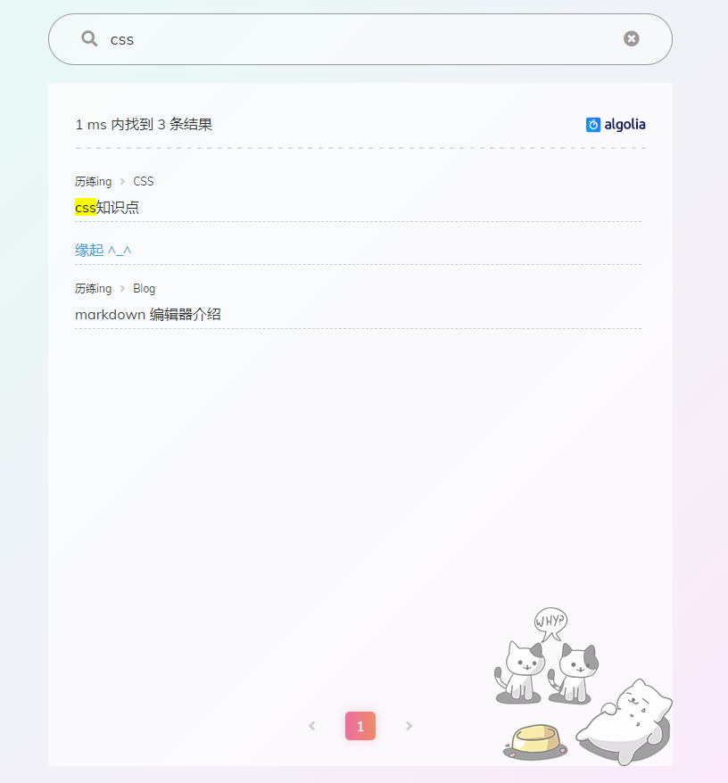
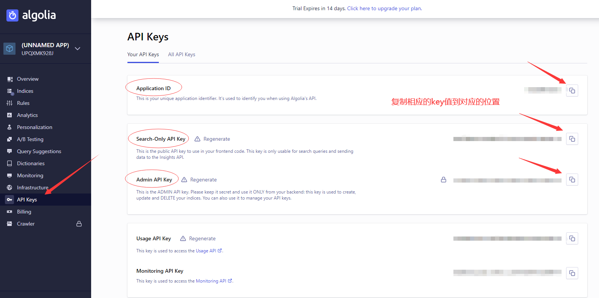

# 在博客中添加搜索功能

> 1. 添加效果
>
>    
>
> 2. 开始添加
>
>    下载最新的hexo主题，因为新的主题已经集成了algolia搜索，可以省去很多配置和修改。去官网注册，也可以绑定github账号登录。[去algolia官网](https://www.algolia.com)，注册好以后进去新建一个index。我们需要用到这个index的名字。
>
>    
>
> 3. 打开API Keys页面，里面的信息等会需要写到hexo的配置文件中
>
>    
>
> 4. 在根目录的站点配置文件_config.yml中加入如下配置，参照上图的各种key值
>
>    ```yaml
>    algolia:
>    appId: 'appid'
>    apiKey: 'apiKey'
>    adminApiKey: 'adminApiKey'
>    indexName: '上面填写的index名'
>    chunkSize: 5000
>    fields:
>    - title
>    - slug
>    - path
>    - content:strip
>    ```
>
>    我用的是shoka主题，这主题默认配置好了以下这些配置,所以`无需手动配置`。
>
>    ```yaml
>    algolia_search:
>      enable: true
>      hits:
>        per_page: 10
>      labels:
>        input_placeholder: Search for Posts
>        hits_empty: "我们没有找到任何搜索结果: ${query}"
>        hits_stats: "找到${hits}条结果（用时${time} ms）"
>    ```
>
> 5. 在git bash中执行`hexo algolia`把配置提交到algolia上。
>
>    ```yaml
>    hexo algolia
>    ```

