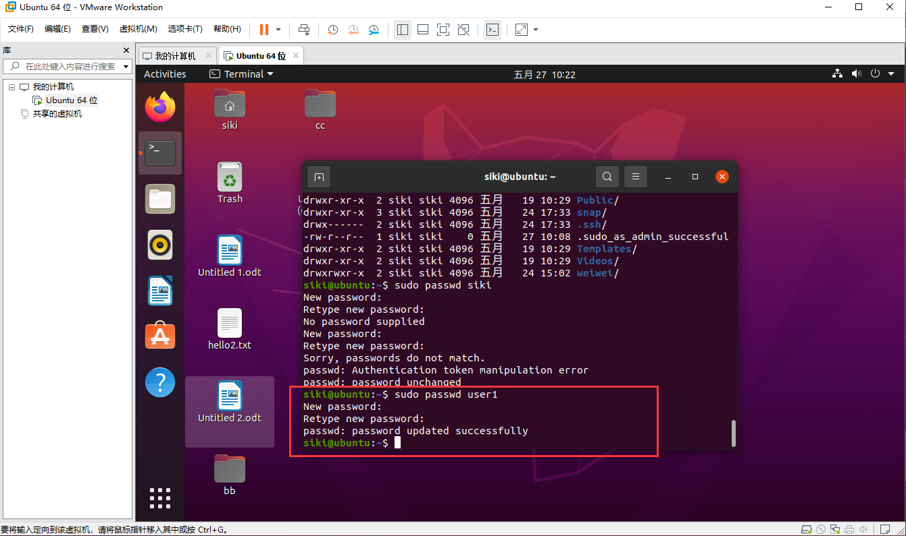

# linux文件系统

linux中没有盘符的概念，只有一个根目录。根目录用`/`表示。

1. `/`根目录下有以下几个文件。

   - `/bin`
   - `/etc`
   - `/home`
   - `/lib`
   - `/usr`

   这些不同的目录都有不同的作用。每个目录的作用介绍可查看[Linux目录介绍](http://www.cnblogs.com/duanji/p/yueding2.html)

2. Linux常用命令

   - **pwd**查看当前在那个目录以及是那个用户。当前路径。
   
   - **ls**查看当前目录下有那些文件夹，有颜色的或者有后缀名的是文件夹，可以打开，没有的是文件。
   
   - **cd**进入到文件夹。进去了之后可以用`pwd`查看，使用cd可以打开多级路径，用/隔开，表示子目录。==注意：==区分大小写
   
     1. cd快捷键，我们可以使用`cd ..`进入目录，cd目录之下有些很长的文件夹名字，我们可能记不住，用ls查看很长也不想敲。这时候可以使用**Tab**键，快捷键打出来。点一下是直接获取到输入的首字母的文件，两下是打开以你输入的字母开头的文件。
   
     2. 回到家目录。直接
   
        ```java
        cd ~
        ```
   
        
   
   - **clear**，清空屏幕命令。
   
   - **ls -l**:罗列出目录，是以竖排这样的方式展示的，ls后面也可以跟路径，此时，罗列出来的目录就是该路径下的目录。
   
   - **ls -a**:罗列出影藏的文件目录。可以和**ls -l**一起使用。
   
     `**ls -l -a**`：竖排查看所有文件，包含隐藏文件。
   
     `**ls -lha**`：竖排显示所有文件，包含隐藏文件，且大小以`k`单位显示出来
   
     只要是隐藏的文件或隐藏的文件夹。用ls查看到的都是前面带个小点的。
   
     在Ubuntu中，如果想创建一个隐藏的文件或者文件夹，只需要在前面加一个点。
   
     **通配符**：类似正则表达式。
   
     - `*`：表示一个或多个。
     - `？`：一个字符。
     - [1、2、3]，也是代表一个字符，但是只能从中括号中选择一个字符。
     - [a-z]，是代表a到z中的任意一个字符。
     
   - **mv**：移动文件夹或文件，也就是剪切。如下：
   
     ```
     mv ceshi.txt /home/siki/weiwei
     mv hello2.txt /home/siki/Desktop/aa/127.txt 	//移动以后改名字为127.txt
     ```
   
     将`ceshi.txt`文件移动到`/home/siki/weiwei`文件夹之下。我们不但可以移动，还可以在移动的时候给他修改文件名字。
   
   - **cp**：复制文件夹或文件，和移动类似。复制是不删除原来位置的文件。复制的过程中，也可以重新命名。==注意：==**cp**复制时如果是文件夹需要在前面加上 `-r`。
   
   - **find**：精确搜索，
   
     ```apl
     find /home -name test.txt
     ```
     
     上面代码说明，在**home**路径下搜索名字为**test**的文件，只要是home下的任何子目录下的test文件都看搜索出来，搜索结果为：展示搜索文件的路径。
     
     ```js
     find /home -name he* 	// 名字中含有he的文件
     find /home -name '12*'  // 名字以12开头的文件
     find /home -iname 'abd'		//	名字为abc开头且不区分大小写。
     ```
     
     搜索**home**之下所有目录中，**名字**带有**he**的所有文件及文件夹。
     
     ```js
     locate 123  // 搜索索引库中的带有123的文件或者文件夹或者路径带有123的都索引出来。
     ```
     
     
   
3. 查看帮助手册，`需要查看帮助的命令`+`–-help`，`man`+需要查看的命令：如下

   ```
   ls --help
   mv --help
   
   man ls
   man mv  	//man命令使用q退出来。
   ```

4. **cat**：查看文件内容。所有内容直接打印出来，适用于查看内容少的文件。

   ```js
   cat -b 123.txt // 查看文件123.txt的内容，使用-b，是显示行号。此行号不包含空行。
   cat -n 123.txt // 查看文件123.txt的内容，使用-n，是显示行号。此行行包括空行。
   ```

   

5. **moar**：也是查看文件内容。所有内容直接打印出来，适用于查看内容少的文件。这个会打印换行。其他的与cat相似。

6. **grep**：抓取文件中的内容；

   ```java
   grpe user 123.txt // 搜索文件名为123.txt中，包含user字段的哪一行内容。
   grep -n user 123.txt // 加上一个-n，是为了显示搜索到的内容显示行号。空行也算行号的
   grpe -v user 123.txt // 反向搜索，搜索文件名为123.txt中，不包含user字段的哪一行内容。
   grpe ^'#' /etc/services // 抓取在/etc/services文件 中以#开头的数据。
   grpe s$ /home // 在/home中 以s结尾的 。
   grpe -i abc 123.txt // 在123.txt中查找abc。且忽略大小写。
   ```

7. **>** 和 **>>** ：**>**把得到或者查询出来的内容保存在其他文件夹，一个**>**代表是全部替换。两个**>>**代表是接在后面。比如：

   ```java
   grep siki 123.txt > test.txt // 抓取文件123.txt中，带有siki字段的内容 且 将它们保存或替换test.txt文件中的内容。如果没有test.txt文件。则会在当前目录下新创建一个test.txt文件用于保存抓取到的文件。
   grep siki 123.txt >> text.txt // 类似上面，唯一不懂的是，这个不是替换text.txt中的类容，而是将它接在text.txt文件内容的后面。
       // 例子如下：
   ll > 123.txt // ll以列表的形式查看当前目录。且把查看到的目录替换保存到123.txt中
   ll >> 123.txt // ll以列表的形式查看当前目录。且把查看到的目录保存到123.txt中
   ```

   总结：一个`>`替换。两个**>>**加在后面。有`text.txt`文件。替换里面的内容，若没有，创建新的`test.txt`文件。

8. **|**：管道。相当于做一个命令的连接。将一个命令的输出改变为输入。

9. **ln**：软连接。相当于windows的桌面快捷方式。

   ```java
   ln aa/123.txt aa_softlink // 意思是 为aa/123.txt 创建一个快捷方式，快捷方式的名字叫aa_softlin
   ```

   修改快捷方式里面的内容，原文件中的内容也会同时被修改。

# 用户管理、权限。

1.  添加用户：

   useradd：添加新用户。

   passwd：添加密码。

   初始用户可以使用**sudo**添加新用户。

   ```java
   sudo useradd user1 // 前面的是命令，user1是需要添加的用户名。
   ```

   此处添加需要输入当前除使用户的登录密码作为严重。验证成功后，就可以创建成功了。我们用这个命令查看刚才创建的用户

   ```java
   cat /etc/passwd	// 查看服务器所有用户。
   ```

   查看到已经创建的用户以后，给创建的用户设置登录密码

   ```java
   sudo passwd user1 // 使用命令sudo + 密码 + 需要设置密码的用户名。这里需要重复一遍
   ```

   

